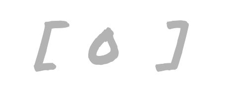
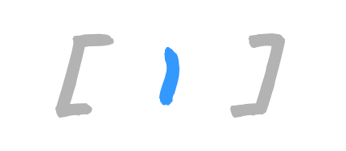
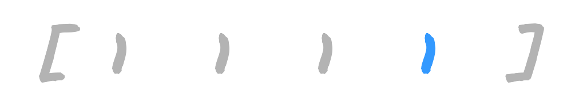
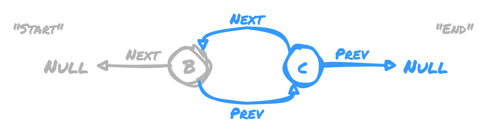
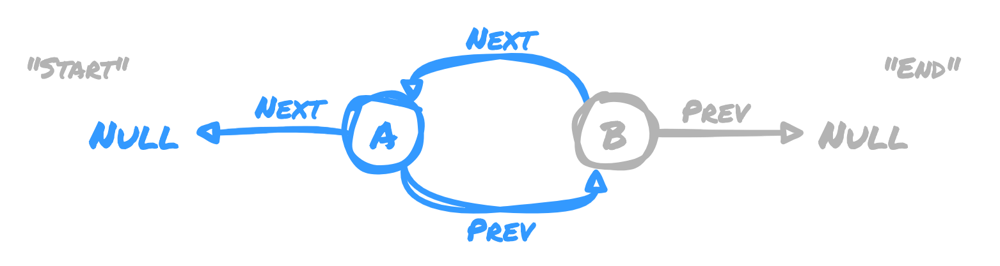
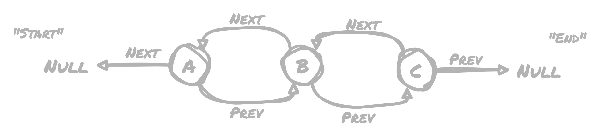

While working at a very slow self pace through the [Algorithms Part I class on Coursera](https://www.coursera.org/learn/algorithms-part1),
I recently finished the section on Stacks and Queues. Of particular interest to me
in this section were two approaches to accommodate a dynamically sized array, and
how memory can be allocated for it. The approaches covered used **linked lists**
and **resizing arrays**.

As an aside, the impetus behind my taking this course was that a couple of months
ago, I joined a Discord to engage with other developers in my area, and some practice
problems were presented involving linked lists 🤔 I haven't ever used linked lists
in my time as a software engineer, so I decided to take the course to fill in my
blind spots. Given that background, I was very interested to learn about some real
world applications where linked lists are used.

Without further adieu, let's talk data structures 🤓

## Resizing Arrays

With a resizing array, you start off allocating memory for an empty array of known
capacity. As items are added to the array, you may need to allocate a new space in
memory for a larger array that holds more items. When you allocate space for the
larger array, you need to copy over all of the items that were previously in the
smaller array. Conversely, when you remove items, you may no longer need to hold
onto the entire allocated memory and can create a new, smaller array, then copy the
items over into that.

One big advantage of a resizing array is that all items are in a contiguous block
of memory, so random access is fast because all you need is the address or index
of the item you want. Iteration is also fast, because you don't need to follow pointers
between items, they're all in that same block of memory.

You might have already spotted the downside to this approach though, keyword being
_copy_. Whenever the array needs to be resized, the copy operation may become expensive
and memory intensive, since you may need to read _and_ write a huge number of items
in order to resize the array. One tactic to avoid the bottleneck here is to reduce
the frequency at which resizing operations occur. The basic logic presented in the
course is:

- When increasing the array size, wait until the number of items matches the current
  length, then double the current length to get the length for the new array
- When decreasing the array size, wait until the number of items is 1/4 the current
  length, then halve the current length to get the length for the new array

By taking the approaches above, we can reduce a lot of unnecessary churn from resizing
too frequently.

### Visualizing a Resizing Array

In this example, I'll keep things simple by showing a `0` for empty spaces in the
array, and a `1` for occupied spaces.

We start off with an empty array with a length of `1`



We add an item to the array. It's full, but we don't need to resize yet.



We go to add another item to the list, but it doesn't fit, so we double the size
of the array before inserting it.


We're already full again, so when we go to add the third item, we double the size
of the array again before inserting.


When we add another item, we already have an empty space to put it into, so do not
need to resize.



Finally, when we add another item, we double the array size again, but notice how
we have an increasingly larger amount of free spaces each time we expand, which will
reduce the frequency at which we need to expand as the data set grows.


## Linked Lists

A linked list is made up of "nodes," each of which has a value along with a pointer
to the "next" node. The "head" of the list points to nothing, or `NULL`, indicating
there is no "next" node.

A big advantage to linked lists is that allocating memory for each new node is generally
trivial, since they don't need to reside in a contiguous block of memory. For a dynamically
sized data set, this can make reads and writes incredibly efficient.

The major downside to linked lists is that they do not facilitate random access -
you need to traverse the entire list if you're looking for something in the middle,
or worse, at the end 😬 The main places where they'd still be useful would be in
stacks and LIFO (last in, first out) queues where random access is not needed, or
it is acceptable that random access is slow.

### Visualizing a Linked List

The start of the list is pointed to as "next" for the node with an item `A`. `A`
is the last node in the list, so it is also at the end of the list. If we want to
traverse this list, we start from the end and travel to the start, so in essence
it is a **stack** data structure. As a stack, items are added to the list and iterated
over following a LIFO (last in, first out) processing order.


As we add nodes to the list, they point to what previously was the end of the list
as their "next" node. This makes our new node the new end of the list.


## Doubly Linked Lists

Doubly linked lists were not covered directly in the course, but as part of one of
the graded assignments, I was tasked with implementing a [Deque](https://en.wikipedia.org/wiki/Double-ended_queue)
data structure, which led me to the awesome power of a doubly linked list 💪

My first approach was to use a resizing array, keeping track of pointers to the first
and last items, then incrementing/decrementing the indices for the add and remove
operations accordingly. Upon submission of my solution, I couldn't get a grade above
`95` due to some failed tests. The tests involved a memory constraint ensuring that
only a small amount of new memory was allocated per new item 🤔 The problem is, with
a resizing array, by its very nature it _needs_ to allocate an increasingly larger
amount of memory 🤦🏻‍♂️ `95` is alright, but I wanted that `100` (and to understand
how to work within specific constraints) dang it.

A doubly linked list suits this problem better, because it allows for traversing
the list both from the front or "head", and from the back or "tail." The only difference
between a regular linked list and doubly linked is that doubly linked nodes also
include a pointer to the "previous" node. So for the deque data structure, we keep
track of the front and back nodes of the doubly linked list, which makes removing
and adding to either end of the list wicked fast and keeps the newly allocated memory
footprint small. Nice 😎

After getting my 💯, I got curious about when a deque is a good choice for real world
applications. Turns out there's a few use cases you may be affected by on a daily
basis:

- Browser history and other undo/redo history implementations. As items get older
  and move to the end of the queue, they can be dropped off to free up memory
- Job priority queues, where high priority items may be placed at the front while
  lower priority are placed at the back

### Visualizing Doubly Linked Lists

We start off with a single node holding item `B`. The node points to a "next" node
of `NULL` indicating this node is at the start of the list. It also points to a "prev"
node of `NULL`, indicating it is at the end of the list.


As we can do in a regular linked list, if we want to add a new node at the end of
the list, we point to its "next" node as what used to be the end. In this example,
we point a node with value `C` at the node with value `B`.

Aside from pointing node `C` at `B`, we _also_ need to set the node `B` "next" node
as node `C`. Node `C` has a "prev" node of `NULL` since it's the new end of the list.



Here's where we can do something different than in the regular linked list. We can
append a new node at the _start_ of the list. To do so, we point the "next" node
that was previously at the start, in this case node `B`, at the new `A` node as its
"next" node. We set the new node's "prev" node as the old start of the list, so `A`
has a "prev" of node `B`. Since `A` is the new start of the list, it's "next" node
is `NULL`.



With everything combined, we have three nodes, each with a corresponding "next" and
"prev" node. If we want to iterate over the list from the start, we can use "prev"
values to travel toward the end. This allows us to do either FIFO (first in first
out) or LIFO (last in first out) processing.



## An Implementation of Deque

Tying it all together, here's how I implemented a deque in Java. There might be a
cleaner way to do it, but this demonstrates how to implement both FIFO and LIFO operations
on a deque.

```java
import java.util.Iterator;
import java.util.NoSuchElementException;

public class Deque<Item> implements Iterable<Item> {
    private int itemCount;
    private DequeNode first;
    private DequeNode last;

    // construct an empty deque
    public Deque() {
        itemCount = 0;
        first = null;
        last = null;
    }

    // is the deque empty?
    public boolean isEmpty() {
        return itemCount == 0;
    }

    // return the number of items on the deque
    public int size() {
        return itemCount;
    }

    // add the item to the front
    public void addFirst(Item item) {
        if (item == null) {
            throw new IllegalArgumentException();
        }

        DequeNode newFirst = new DequeNode();
        newFirst.item = item;
        newFirst.prev = null;
        newFirst.next = first;
        first = newFirst;

        if (isEmpty()) {
            last = first;
        } else {
            first.next.prev = first;
        }
        itemCount++;
    }

    // add the item to the back
    public void addLast(Item item) {
        if (item == null) {
            throw new IllegalArgumentException();
        }

        DequeNode newLast = new DequeNode();
        newLast.item = item;
        newLast.prev = last;
        newLast.next = null;
        last = newLast;

        if (isEmpty()) {
            first = last;
        } else {
            last.prev.next = last;
        }
        itemCount++;
    }

    // remove and return the item from the front
    public Item removeFirst() {
        if (isEmpty()) {
            throw new NoSuchElementException();
        }

        Item item = first.item;
        DequeNode newFirst = first.next;
        first.next = null;
        first = newFirst;

        itemCount--;
        if (isEmpty()) {
            last = null;
        } else {
            newFirst.prev = null;
        }

        return item;
    }

    // remove and return the item from the back
    public Item removeLast() {
        if (isEmpty()) {
            throw new NoSuchElementException();
        }

        Item item = last.item;
        DequeNode newLast = last.prev;
        last.prev = null;
        last = newLast;

        itemCount--;
        if (isEmpty()) {
            first = null;
        } else {
            newLast.next = null;
        }

        return item;
    }

    // return an iterator over items in order from front to back
    public Iterator<Item> iterator() {
        return new DequeIterator();
    }

    private class DequeIterator implements Iterator<Item> {
        private DequeNode current = first;

        public boolean hasNext() {
            return current != null;
        }

        public void remove() {
            throw new UnsupportedOperationException();
        }

        public Item next() {
            if (!hasNext()) {
                throw new NoSuchElementException();
            }

            Item item = current.item;
            current = current.next;
            return item;
        }
    }

    private class DequeNode {
        private Item item;
        private DequeNode next;
        private DequeNode prev;
    }
}
```
