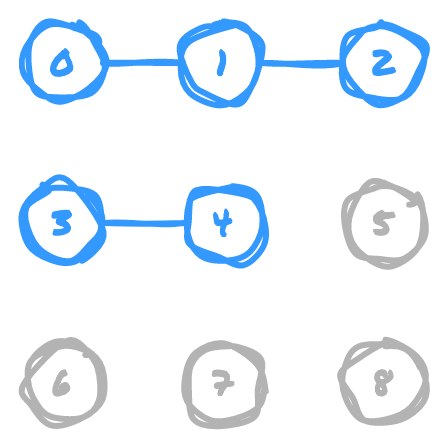

I recently dove into the [Algorithms Part I class on Coursera](https://www.coursera.org/learn/algorithms-part1?)
to get a better grip on some of my programming fundamentals. As I go through the
course, I'll be writing up on what I learned, for the sake of better solidifying
concepts in my mind by explaining them. So far I'm learning quite a bit about thinking
through the data structures used to solve a problem. The only downside for me with
the course so far has been that I have to submit solutions written in Java 🤮

The first algorithm covered is the _Weighted Quick Union with Path Compression_.
The coolest thing about it to me that the teacher points out, is that it solves a
problem where brute forcing a large enough data set with a regular _Quick Find_ algo
would take over 30 years, whereas weighted quick union with path compression takes
**_~6 seconds for the same data set!_** 🤩

## What Problem Does This Algorithm Solve?

Let's say you have a grid of points, and you have connections between some of the
points in the grid. What if you wanted to quickly determine if two points are somehow
connected, either directly or through intermediary points? For example, determining
if two random points in this diagram are connected or not:

There are a couple of operations that are relevant to this:

- Modeling the connection between two points (creating a _union_)
- Checking if two points are connected (finding a _path_)

For the explanations below, we'll mostly be working with a 3x3 grid to keep things
simple.

Note that a 3x3 grid can also be thought of as an array, you just need to use a little
maths to find an index of the array based on row and column number.

## How Quick Find Works

The basic idea behind _Quick Find_ is to keep track of a parent ID for each element.
In our 3x3 grid example, we start off with each item in the grid having its own ID,
corresponding to the index it occupies in the array. As unions are made, the IDs
get updated so that all connected points share the same ID.

For example, if we formed the following unions, our array would get updated as such:

`(0,1)`

Set the ID for item `1` to `0`

`(1,2)`

Set the ID for item `2` to `0`, since item `1` already had an ID of `0`

`(3,4)`

Set the ID for item `4` to `3`

With those unions, the grid would look like this:

So if we want to find out if two points are connected, say points `0` and `2`, we
would simply use those indexes in the array to determine if both have the same ID.
In our array, they both have an ID of `0`, so they are connected. Since points `0`
and `3` have different IDs, they are not. This makes it very quick to _find_ if there
is a connection.

### Why Quick Find is Slow

To initialize the array to keep track of unions, we require `n` number of operations,
where `n` is the number of items we need to represent. This part can't really be
avoided in any of the algorithms we'll be covering here, since we need to build out
the initial data structure that keeps track of all the points.

While finding if two items are connected is very fast, **establishing unions is not**.
For each union operation, we need to iterate over the entire array of IDs to determine
if any of them need to be updated. In our small example, if we were to add a union
for `(0,3)`, we then need to find all items that already have an ID of `3` and update
them to `0`. In order to get this:

We need to update the array to this:

In order to do so, we have to check _every single item in the array other than_ `0`
to see if each should be updated to point to `0`. We have to check everything to
see "Does this ID match the ID of what's being added to the union?" This operation
is expensive on significantly large datasets, because with an array of `n` size,
we have to find and potentially update `n - 1` IDs in the array. Since the number
of operations grows linearly with the number of items, we essentially have `n` number
of operations. Thus, between initializing the data structure and performing all required
union operations on it, _Quick Find_ is an `n^2` algorithm (bad).

## How Quick Union Works

OK, so we know that it's expensive to check and update all of the items' IDs as they
get added to a given union. What if we could reduce the number of items that need
to be updated per _union_ operation? That's the approach that _Quick Union_ takes.

Rather than updating the IDs of all connected items, _Quick Union_ creates a tree
structure so that given an index of an item in the array, its value is the index
of its tree's root node. Given two IDs, you can find if they have the same root node
to determine if they're connected.

For the most part we'll use the same example as before, except more unions will be
made to drive the point home. Notice as we go through this how for each step we only
need to update the value of the ID in the array for a single item per union, so we
don't need to access every single item in the array to establish a union like with
_Quick Find_. When establishing a union, we determine the parent node in the tree
of each item being added to the union, then point the parent node of the second argument
at the parent node of the first argument.

`(0,1)`

`1` now points to `0`, because `0` is the parent node of `0`'s tree

`(1,2)`

`2` now points to the root of `1`'s tree, which is `0`

`(3,4)`

`4` now points to `3`, because `3` is the root node of `3`'s tree

`(4,5)`

`5` now points to the root of `4`'s tree, which is `3`

`(6,3)`

`3` now points to `6`, because `6` is the root of `6`'s tree

`(7,6)`

`6` now points to `7`, because `7` is the root of `7`'s tree

`(7,8)`

`8` now points to `7`, because `7` is still the root of `7`'s tree

`(2,5)`

`7` now points to `0`, because `7` is the root of `5`'s tree, and `0` is the root
of `2`'s tree

All of these operations have connected the grid in the following way:

### Why Quick Union is Slow

In order to determine if two points are connected, we compare the parent node for
both points provided. For example, if we want to check if `2` and `7` are connected,
the operation is very fast because both have an immediate parent node of `0`. However,
if we want to check if `5` and `8` are connected, we have to traverse a tall tree
(`5` → `3` → `6` → `7`) to determine that they share a parent node at `7`. For large
datasets, this can become a problem because in the worst case, the tree will be `n - 1`
levels deep. So even though we reduced the amount of time required for creating
unions, we have just moved those saved costs over to the _find_ procedure, and are
back to an `n^2` algorithm (still bad) 🤦🏻‍♂️

## How Weighted Trees Improve Quick Union

All is not lost, however. The main issue in our previous implementation is that it
does not account for the height of the trees being added to a union. If we want our
trees to remain shorter, we can compare their sizes before creating each union to
ensure that the shorter tree is added to the parent node of the taller tree. Given
the tree below, we can demonstrate how pointing the parent node of the shorter tree
at the root node of the taller tree can mitigate some of the height increase

If we point `0` (the root node of the taller tree) at `4` (the root node of the shorter
tree), our overall tree depth _increases_ from `2` to `3`. This effect will compound
itself on larger data sets.

However, if we point `4` (the root node of the shorter tree) at `0` (the root node
of the taller tree), we _maintain_ the overall tree height.

When we mitigate the tree height with this technique, we get a huge performance gain,
because _find_ operations no longer have a worst case of possibly having to scan
`n - 1` items to find the parent node. We've reduced the worst case for the _find_
operation down to `lg n` because the depths of trees can only grow at a rate of `lg
n`.

I'm not a math whiz, so that part is the one part of all this that I haven't fully
internalized yet. 🤔 I can intuit that the trees grow more slowly than before, but
_why_ that growth is at a rate of `lg n` is the part I'm a little fuzzy on.

Excuse my brief tangent while I think this through... `lg n` is the inverse of `2^n`.
For a concrete example, `2^5` is `64`, and `lg 64` is `5`. As we continue to double
the input size, the time only increases by `1` per each doubling of input size...
`lg 128` is `6`, `lg 256` is `7`, `lg 512` is `8`, etc. By the time we get to an
input size of `~16,400`, time has only increased to `~14` 😎

The reason trees can only grow at that rate in the weighted quick union is that in
order for the tree depth to increase by `1`, we need to double the input size. A
tree can only reach depth of `1` with input of `2`, `2` with input of `4`, `4` with
input of `16`, `5` with input of `64`, etc.

In the following diagram with a "worst case" where we have to increase the tree depth
as much as possible based on the created unions, we end up with a max depth of `4`
for an input of `16`, and if we were to continue to double the input size, at worst
we'd only add one new layer of tree depth per doubling. Thus, it takes at most `lg
n` time to traverse a tree to find its parent node.

## How Path Compression Improves Upon Weighted Quick Union

OK, tangent aside, we can take this one step further, by nearly eliminating tree
height altogether. We can do this by pointing intermediate nodes in a tree at the
root node as we create each union, so that the immediate parent of any given node
is either itself or the root node. In the example below, let's say we want to add
a union between `4` and `6`. The intermediate nodes we have to traverse to determine
`4`'s parent node are `3` and `2`, and its parent node is `0`.

Using path compression, we can set all of the intermediate nodes of `4`, as well
as its parent node, to point at the parent node of the other member of the union,
`6`. Notice how this reduces the size of the tree that must be traversed in order
to determine a common parent node for any given item, making it incredibly fast to
determine if two points are connected. If we're compressing the paths from the start,
as we add each union it should usually only take traversing a single pointer to get
each parent node, so any performance we lose on the _union_ operation is negligible
in comparison to what we gain in speed for _find_ operations.

This reduces the maximum depth of the tree structure to `lg* n`, and although, once
again, I'm no math whiz, I can intuit that this is even more shallow than `lg n`.
The math shows that we'd need to have `65,536` inputs to reach a tree depth of `4`
🤯

## Conclusion

There was a lot to wrap my head around on this one, but I'm glad I got to learn about
it and start thinking about stuff like this to reduce compute time while solving
large problems. Even though it's the weighted trees that bring the biggest boost
in performance gains, my favorite trick is the path compression, I just think that
is nifty.

We started with two ways of solving the problem that both take `n^2` time, and ended
up with something that is `n + m lg* n` (`n` operations to build the initial data
structure, `m` number of unions/finds, `lg* n` time to find a given parent node)
which is _muuuch_ better. My biggest takeaway that was driven home here was that
any time you _can_ avoid having to potentially iterate an entire array, _**avoid
it**_! If there's a possibility to use compressed trees to reduce lookup time, that
can also be helpful.

I hope this walkthrough has helped you to understand this awesome algorithm 🤓
