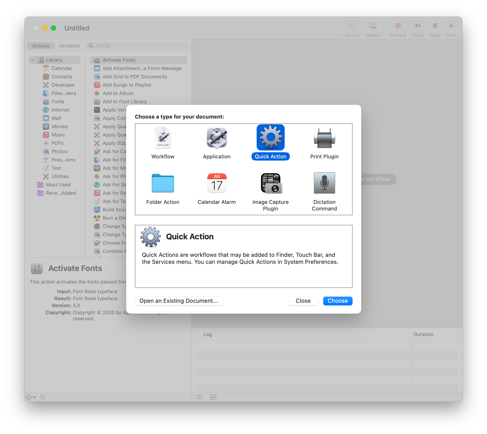
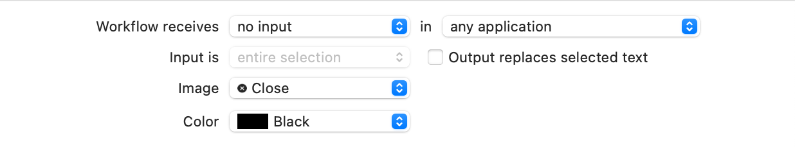
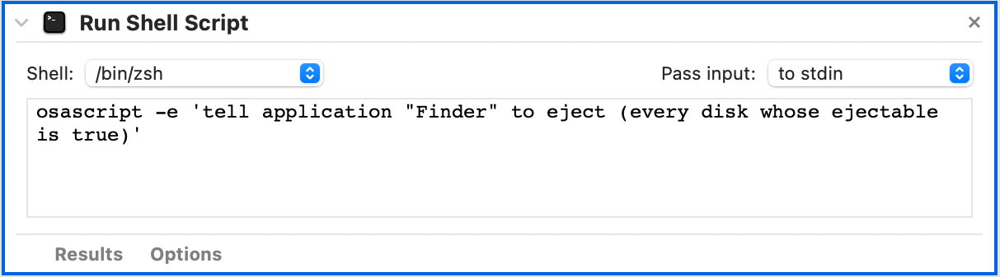
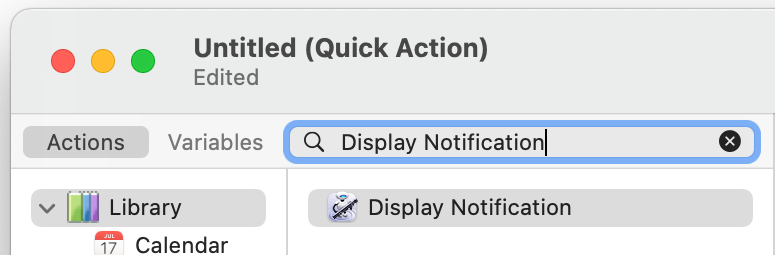
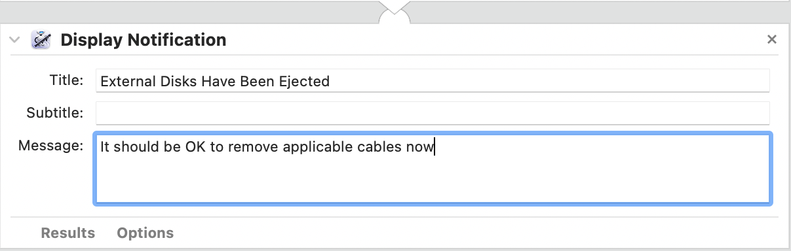
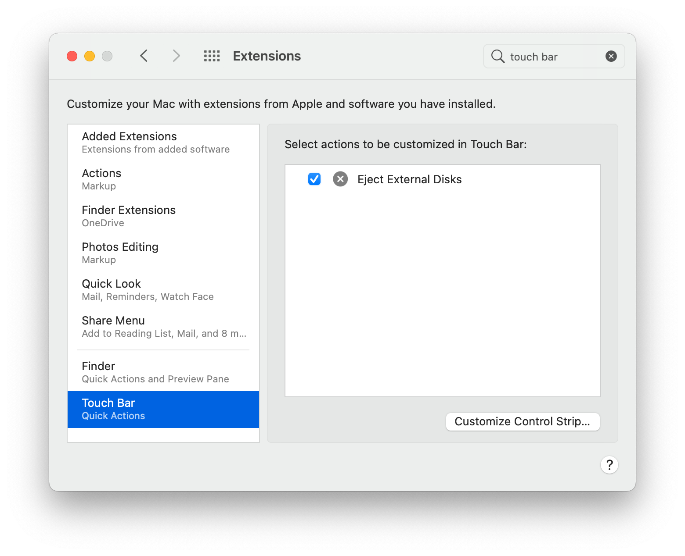
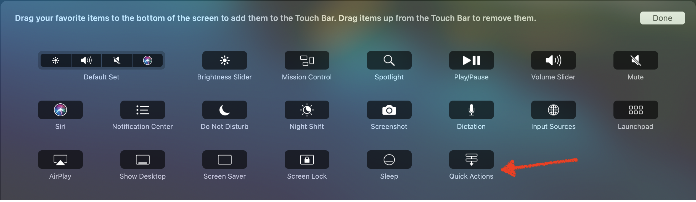
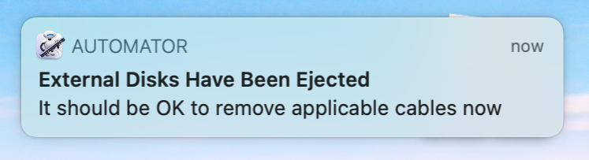

## The Joy and Pain of a Docking Station

I love having a docking station to connect my power, second monitor, audio interface,
HD camera, external hard drives, etc. all through one port to my MacBook Pro. It's
super convenient and makes switching from "full-on workstation" to "lounging around
the house" mode fast and (nearly) painless.

However, one big pain in the butt that used to plague me was that if I didn't eject
the external hard drives before pulling the cable, I'd get a bunch of notifications
telling me that I hadn't ejected those. I only have two physical external hard drives,
but they're partitioned into multiple drives each so those notifications pile up
pretty quick.

That pain is a thing of the past with this nifty little Touch Bar button that I built
using _Automator_. Hopefully this "Eject All External HDs" button can help you out
if you're in a similar place. Here's how to add it to your MacBook.

## Create the Automator Quick Action

First, open the Automator app and select the Quick Action document type.



Set the _Workflow receives_ option to _no input_ and select an _Image_ that you like.



Use the search bar to look for the _Run Shell Script_ action, and add it to your
_Quick Action_.


Add the following line as the script to run (thanks for the script go to the author
of [this StackOverflow answer](https://stackoverflow.com/a/7222469/5072076)):

```shell
osascript -e 'tell application "Finder" to eject (every disk whose ejectable is true)'
```



You could leave it at this, but then when you run the task you'd have to open _Finder_
or _Disk Utility_ to see when all the disks have been ejected. Let's fix that by
adding a second action. Select the _Display Notification_ action, and add it to your
_Quick Action_.



Set a title/subtitle/message that works for you. I have mine configured like this:



Save the _Quick Action_ with a title that makes sense to you, I call mine _Eject
External Disks_.

## Make the Quick Action a Touch Bar Button

The most convenient way for me to fire off this task is using the Touch Bar, but
you can also access it from the Services Menu if you like, or if your MacBook doesn't
have a Touch Bar.

To add it to the Touch Bar, go to _System Preferences_ -> _Extensions_ -> _Touch
Bar_ and ensure it's selected.



Next, click _Customize Control Strip_... and drag the _Quick Actions_ button down
onto your Touch Bar.



## Enjoy the Lack of Pain When Pulling Away from Your Docking Station

Now, the next time you need to eject all the external hard drives from your MacBook
before disconnecting your docking station, just tap the _Quick Actions_ icon in your
Touch Bar and hit the _Eject External Disks_ button, then wait for the _Automator_
notification to pop up.


